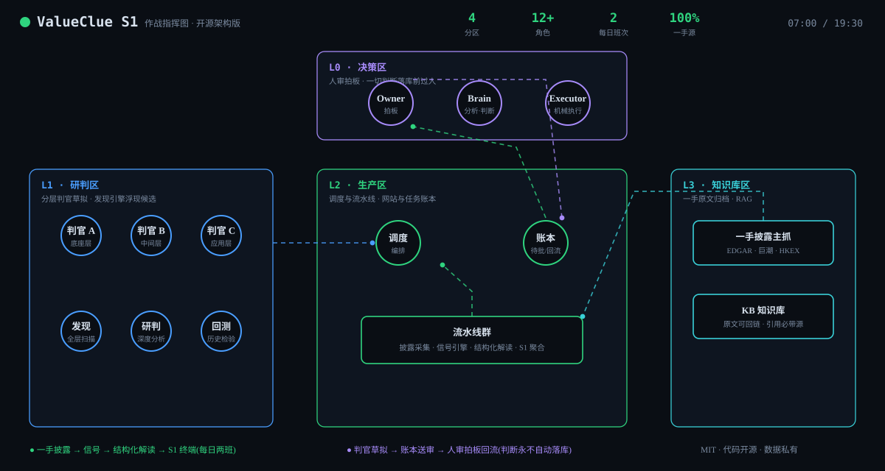
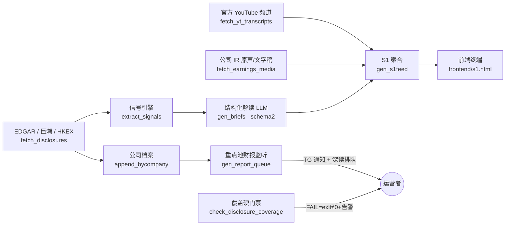

# ValueClue S1 — AI 算力产业投研情报流水线(开源版)

一套面向 **AI 算力产业链** 的一手情报采集与结构化解读系统:从交易所披露原文出发,经信号引擎与 LLM 结构化分析,产出「公告 / 财报 / 电话会议 / CEO 视频逐字稿」四条一手情报流的前端终端。

> 本仓库**只包含代码**。不含任何投资判断库、研究报告、采集数据与凭据 —— 那些属于运营者私有。所有密钥经环境变量注入,代码中零硬编码。

## 设计原则

1. **一手源纪律** — 只认交易所/公司官方披露(SEC EDGAR、巨潮资讯、HKEX、公司 IR 官网、官方 YouTube 频道);二手转录站不作数据源。
2. **诚实解读** — LLM 解读强制结构化 JSON(方向/置信度/核心观点/论据/影响/风险),公告未披露的数值必须写「公告未披露」,禁止编造;财报解读只用官方正文摘录,资料不足时结论必须是「待核验」。
3. **防假绿** — 覆盖体检带硬门禁(published>0、checked>0),0/0 空转直接非零退出并告警;调度失败必须喊人,静默红灯视为事故。
4. **重活分离** — 视频/ASR 等重计算落工作机,Web 服务器只做调度与轻数据。

## 架构

## 目录

| 路径 | 说明 |
|---|---|
| `pipeline/run_disclosures.sh` | 每日两班总编排(采集→信号→解读→排队→聚合) |
| `pipeline/fetch_disclosures.py` | 三所披露采集(EDGAR/巨潮/HKEX),UA 遵守 SEC 规范 |
| `pipeline/extract_signals.py` | 规则信号引擎:融资稀释/回购增持/扩产等 8 类,方向初判 |
| `pipeline/gen_briefs.py` | LLM 结构化解读(schema2:方向/置信/论据/影响/风险);财报走官方正文摘录+历史基线防编造 |
| `pipeline/gen_report_queue.py` | 重点池标的财报落地→深读排队;重大公告→即时通知 |
| `pipeline/check_disclosure_coverage.py` | 覆盖体检硬门禁(0/0 假绿必红) |
| `pipeline/gen_s1feed.py` | S1 前端数据聚合器 |
| `collectors/fetch_yt_transcripts.py` | 官方频道 CEO/大会视频→字幕逐字稿(不下载视频,无字幕落 ASR 队列) |
| `collectors/fetch_earnings_media.py` | 公司 IR 官网业绩会原声/文字稿(按公司 profile,不猜链接) |
| `ops/mcp_audit.py` | MCP 配置注入面安全体检(检查会被当命令执行的字段) |
| `frontend/s1.html` | 单文件情报终端:公告/财报/电话会议/涌现四页 + 结构化解读栏 |

## 部署要点

1. 复制 `.env.example` 为环境文件并填值(SEC 联系邮箱、LLM 网关、Telegram 等)。
2. `pipeline/run_disclosures.sh` 挂系统 crontab 每日两班(示例 `0 7 * * *` 与 `30 19 * * *`)。
3. `collectors/fetch_yt_transcripts.py` 建议部署在独立工作机(需 `yt-dlp` + `youtube-transcript-api`)。
4. 前端为纯静态单文件,任意 Web 服务器可托管;数据经 `gen_s1feed.py` 产出的 `feed.json` 驱动。

## 免责声明

本项目仅为信息采集与整理工具,输出内容不构成任何投资建议。使用者需自行遵守各数据源的服务条款与访问频率限制。

## License

MIT
